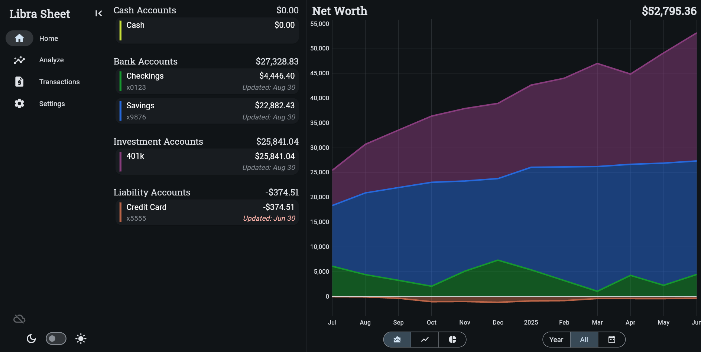
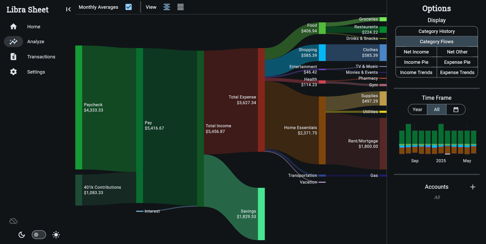
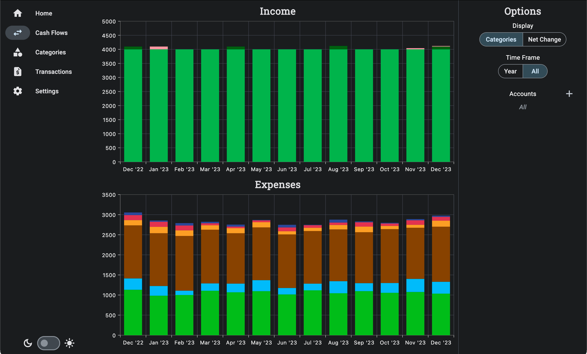
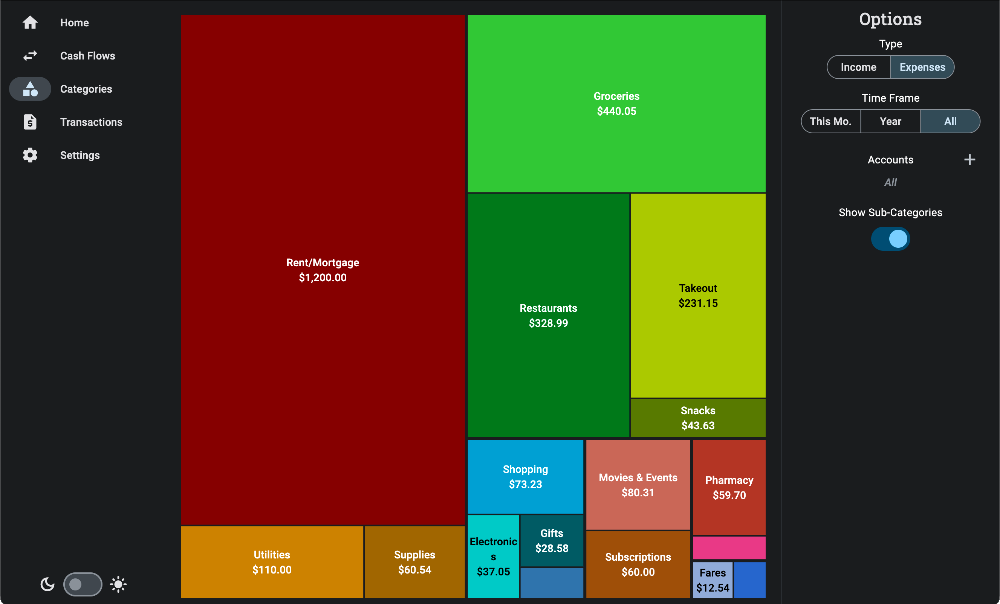
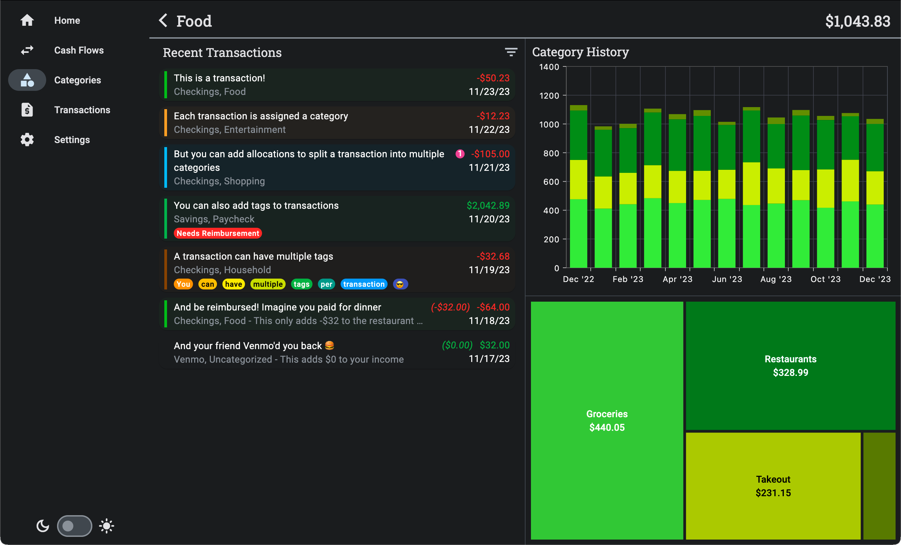

# Libra Sheet

This is a Flutter app for tracking and categorizing your expenses. It is designed for desktop environments.

## Preview

You can preview a web-based version at [riley-x.github.io/Libra_Sheet](https://riley-x.github.io/Libra_Sheet/). This uses some dummy data so you can see all the different features. If you want to use it for yourself, just delete all the transactions (shift-select and batch delete). Be warned that all your data will be saved in the browser cookies; make sure to make backups!

(The delete account doesn't work yet, just rename them).

### Your accounts and net worth at a glance

### See where you spend your money

### And how it changes over time

### With multiple different visualizations

### Or view details for a specific category

## Features

* Fully customizable categories and sub-categories
* Fully customizable transaction tags
* **Input transactions via CSV**
  * Automatic categorizing, but you have to define your own rules
* Reimburse transactions
  * Imagine you paid $60 for dinner with a friend and they Venmo you back $30
  * Your real expense is only $30, and the Venmo transaction shouldn't count as income
* Dark/light theme
* Fully offline; no internet connection necessary. Everything is saved to a local SQLite file.
* Optional syncing with Google Drive
